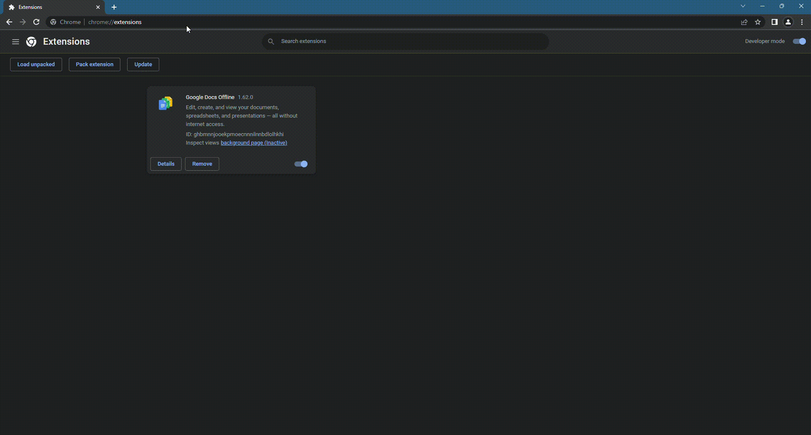

# OmniSearch Chrome Extension
[The omnibox](https://developer.chrome.com/docs/extensions/reference/omnibox/) is a powerful feature in web browsers like Chromium, combining the functionalities of a search bar and a web address bar into a single input field. It provides suggestions as you type, based on your browsing history and bookmarks, making it easier to navigate the web or perform searches without visiting a search engine's website. [Extension Name] leverages this feature by allowing you to directly search pre-defined websites using a designated keyword followed by your query, instantly redirecting you to the relevant search results page on the corresponding site. 

This extension is uses letters as a keyword. Omnibox is not support changing keyword runtime. So you can modify or download builds for letter you want. Each letter has different project name so you can use any letter build at same time. 

### How to install & Use
* Download at a release that you want to use it. 
* Extract zip
* Chrome => Extensions => Manage Extension
* Open Developer Mode (Top right corner)
* load unpacked => select extension folder
* Open new tab and type keyword and search term. Suggestions will be listed.

